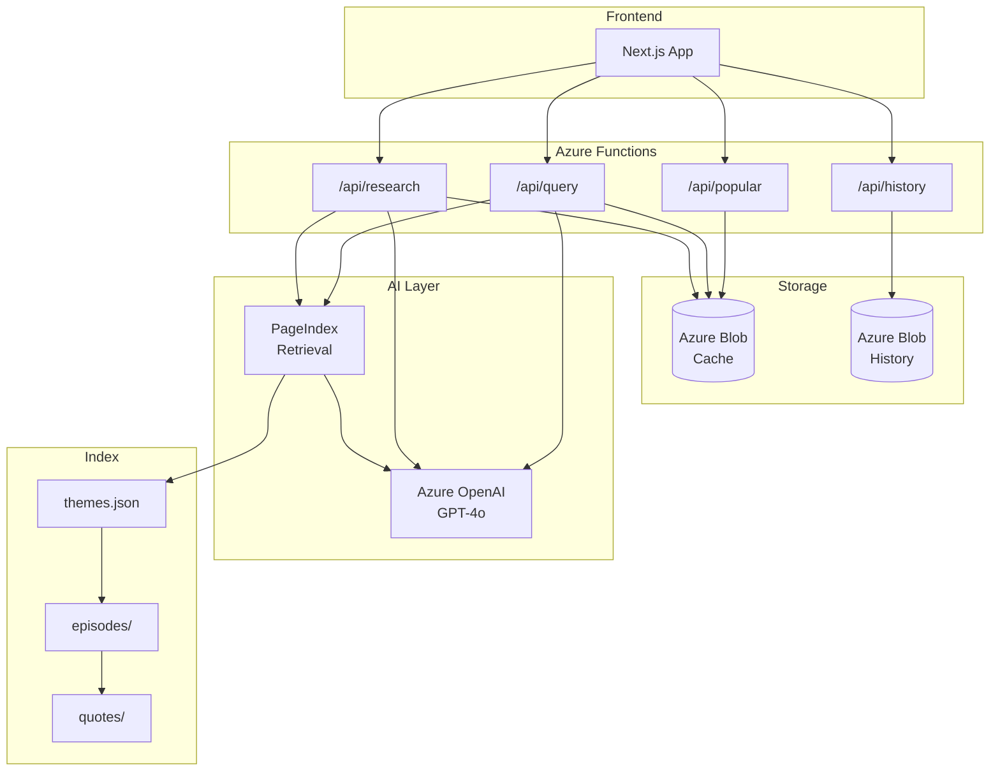
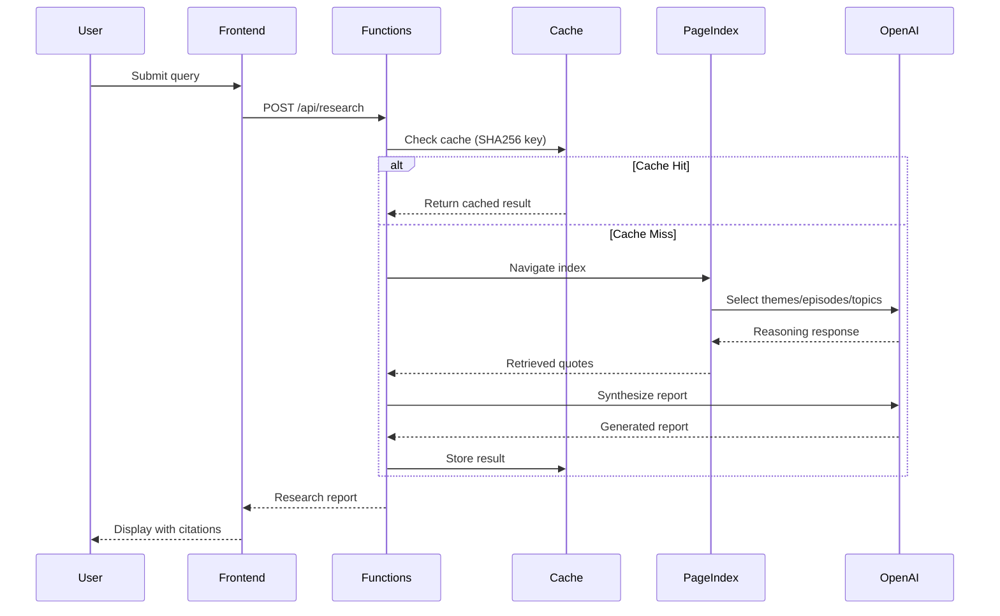

# Lenny's Research Bot

An AI-powered research assistant that searches 300+ hours of [Lenny Rachitsky's](https://www.lennyspodcast.com/) podcast transcripts to generate long-form articles, research reports, and Q&A responses with verified citations.

**What it does:**
- Ask any question about product management, growth, startups, or career advice
- Get a comprehensive research report in ~60 seconds
- Every claim backed by timestamped YouTube citations you can verify

**Example query:** *"What do top PMs say about finding product-market fit?"*

→ Returns a structured report synthesizing insights from multiple guests (Rahul Vohra, Shishir Mehrotra, etc.) with direct quotes and video timestamps.

---

## Key Features

🔍 **Reasoning-Based Search** — Uses LLM navigation instead of keyword/embedding matching. Understands that "difficult stakeholders" relates to topics like "managing up" even without word overlap.

📝 **Research Reports** — Generates structured, long-form articles synthesizing insights across multiple episodes and guests.

✅ **Citation Verification** — Every quote is validated against source transcripts using fuzzy matching. Only verified quotes are presented as citations.

🎬 **Timestamped Deep Links** — Citations link directly to the exact moment in YouTube videos.

⚡ **Smart Caching** — Previously-asked queries return in ~2 seconds vs ~60 seconds for fresh research.

🔥 **Popular Queries** — Discover what others are asking. High-traffic queries are surfaced for exploration.

🔒 **Privacy-First** — Anonymous session IDs for history. No auth required, no personal data stored.

---

## Tech Stack

| Layer | Technology |
|-------|------------|
| **Frontend** | Next.js, React, TypeScript, Tailwind CSS |
| **Backend** | Python 3.11, Azure Functions (serverless) |
| **AI/LLM** | Azure OpenAI (GPT-4o) |
| **Storage** | Azure Blob Storage (cache + history) |
| **Retrieval** | PageIndex (reasoning-based, no vector DB) |
| **Verification** | rapidfuzz (fuzzy string matching for citations) |
| **Deployment** | Azure Static Web Apps, GitHub Actions CI/CD |

---

## Architecture



### Request Flow



---

## Design Choices

### 1. PageIndex over Vector Search

The most significant architectural decision. Instead of embedding-based retrieval (Azure AI Search, Pinecone, etc.), we use LLM reasoning to navigate a hierarchical index.

**→ See [detailed comparison below](#why-pageindex-over-vector-search)**

### 2. Four-Stage Deep Research Pipeline

Complex queries require more than single-pass retrieval. The pipeline:


| Stage | Purpose |
|-------|---------|
| **Query Analysis** | Decompose query into sub-questions, identify topics and guests |
| **Broad Retrieval** | PageIndex navigates themes → episodes for context |
| **Deep Retrieval** | Drill into topics → quotes for specific citations |
| **Synthesis** | Generate report with verified citations |

This staged approach ensures comprehensive coverage while maintaining citation accuracy.

### 3. Defensive Citation Verification

LLMs can hallucinate quotes. Every generated citation is validated:

```python
# Fuzzy match quote against source chunks
match_ratio = rapidfuzz.fuzz.ratio(generated_quote, source_chunk)
if match_ratio < VERIFICATION_THRESHOLD:
    quote.flag_as_unverified()
```

Only quotes that pass verification appear as trusted citations.

---

## Why PageIndex

PageIndex is a reasoning-based retrieval architecture that navigates a hierarchical index using LLM reasoning instead of embedding similarity.

### How It Works


At each stage, the LLM reads descriptions and reasons about relevance — selecting themes, narrowing to episodes, then drilling into specific conversation topics.

| Stage | What Happens |
|-------|--------------|
| **Theme Selection** | LLM reads theme descriptions, selects relevant ones: *"This query relates to 'Founder Journey' and 'Strategy' themes"* |
| **Episode Selection** | LLM reads episode summaries within selected themes, narrows to specific episodes |
| **Topic Selection** | LLM identifies relevant conversation topics within episodes |
| **Quote Retrieval** | Extracts verbatim quotes with speaker attribution |

### Benefits for This Use Case

**Explainable Retrieval**
The reasoning trace shows *why* content was selected: "This query about pivoting relates to the 'Founder Journey' theme, specifically Dalton Caldwell's episode on failed startups." This transparency helps verify and debug results.

**Hierarchical Navigation**
The themes → episodes → topics → quotes structure mirrors how a human researcher would explore the corpus. It's intuitive and produces well-organized results.

**No Embedding Infrastructure**
The index is plain JSON files — no vector database to provision, configure, or pay for. Simpler deployment and fewer moving parts.

**Natural Speaker Context**
When the LLM reads topic descriptions, it naturally understands speaker context ("Rahul Vohra discusses...") without needing explicit metadata filtering.

### Trade-offs

- **Latency**: Multiple LLM calls per query (mitigated by aggressive caching)
- **Cost per query**: LLM tokens consumed at query time
- **Scale**: Works well for ~300 hours of content; larger corpora may need different approaches

### Further Reading

PageIndex was developed by VectifyAI. To learn more about the approach:

- 📄 [PageIndex Introduction](https://pageindex.ai/blog/pageindex-intro) — Original concept and motivation
- 📄 [Mafin 2.5: PageIndex in Practice](https://pageindex.ai/blog/Mafin2.5) — Real-world implementation details
- 💻 [PageIndex GitHub Repository](https://github.com/VectifyAI/PageIndex/tree/main) — Reference implementation

---

## Links

| Resource | Description |
|----------|-------------|
| 🚀 **[Live Demo](https://gentle-bay-045ee9110.6.azurestaticapps.net/)** | Try the research bot |
| 📚 **[Lenny's Podcast Transcripts](https://github.com/ChatPRD/lennys-podcast-transcripts)** | Source transcripts indexed by this project |
| 📄 **[PageIndex Introduction](https://pageindex.ai/blog/pageindex-intro)** | Original concept and motivation |
| 📄 **[Mafin 2.5: PageIndex in Practice](https://pageindex.ai/blog/Mafin2.5)** | Real-world implementation details |
| 💻 **[PageIndex GitHub](https://github.com/VectifyAI/PageIndex/tree/main)** | Reference implementation |
