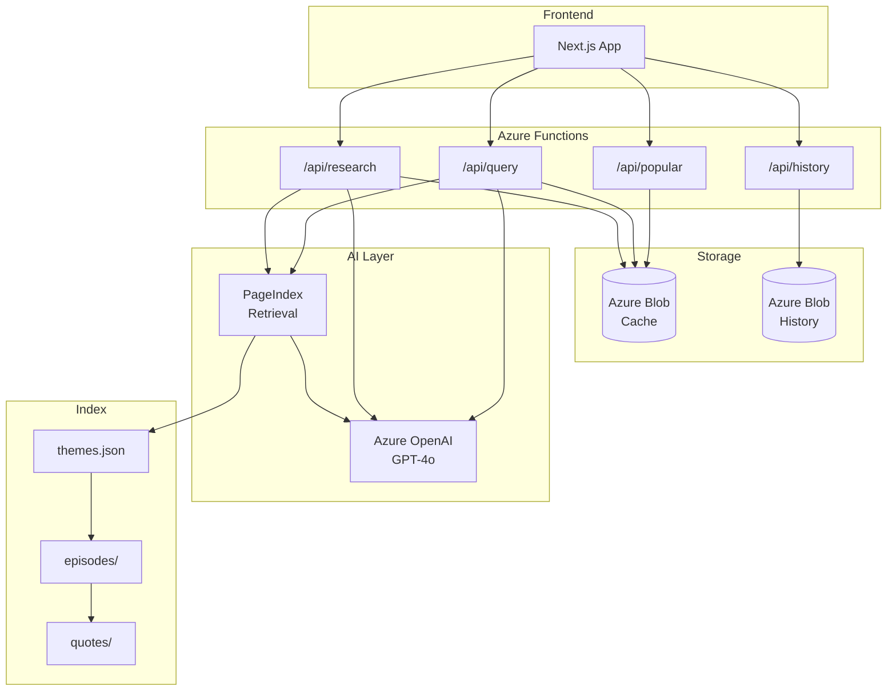
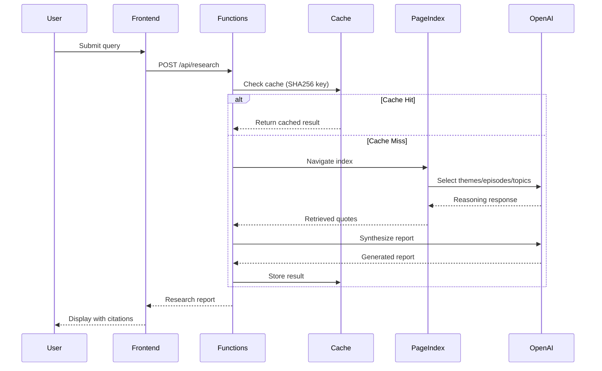

# Lenny's Research Bot

An AI-powered research assistant that searches 300+ hours of [Lenny Rachitsky's](https://www.lennyspodcast.com/) podcast transcripts to generate long-form articles, research reports, and Q&A responses with verified citations.

**What it does:**
- Ask any question about product management, growth, startups, or career advice
- Get a comprehensive research report in ~60 seconds
- Every claim backed by timestamped YouTube citations you can verify

**Example query:** *"What do top PMs say about finding product-market fit?"*

→ Returns a structured report synthesizing insights from multiple guests (Rahul Vohra, Shishir Mehrotra, etc.) with direct quotes and video timestamps.

---

## Key Features

🔍 **Reasoning-Based Search** — Uses LLM navigation instead of keyword/embedding matching. Understands that "difficult stakeholders" relates to topics like "managing up" even without word overlap.

📝 **Research Reports** — Generates structured, long-form articles synthesizing insights across multiple episodes and guests.

✅ **Citation Verification** — Every quote is validated against source transcripts using fuzzy matching. Only verified quotes are presented as citations.

🎬 **Timestamped Deep Links** — Citations link directly to the exact moment in YouTube videos.

⚡ **Smart Caching** — Previously-asked queries return in ~2 seconds vs ~60 seconds for fresh research.

🔥 **Popular Queries** — Discover what others are asking. High-traffic queries are surfaced for exploration.

🔒 **Privacy-First** — Anonymous session IDs for history. No auth required, no personal data stored.

---

## Tech Stack

| Layer | Technology |
|-------|------------|
| **Frontend** | Next.js, React, TypeScript, Tailwind CSS |
| **Backend** | Python 3.11, Azure Functions (serverless) |
| **AI/LLM** | Azure OpenAI (GPT-4o) |
| **Storage** | Azure Blob Storage (cache + history) |
| **Retrieval** | PageIndex (reasoning-based, no vector DB) |
| **Verification** | rapidfuzz (fuzzy string matching for citations) |
| **Deployment** | Azure Static Web Apps, GitHub Actions CI/CD |

---

## Architecture



### Request Flow



---

## Design Choices

### 1. PageIndex over Vector Search

The most significant architectural decision. Instead of embedding-based retrieval (Azure AI Search, Pinecone, etc.), we use LLM reasoning to navigate a hierarchical index.

**→ See [detailed comparison below](#why-pageindex-over-vector-search)**

### 2. Four-Stage Deep Research Pipeline

Complex queries require more than single-pass retrieval. The pipeline:


| Stage | Purpose |
|-------|---------|
| **Query Analysis** | Decompose query into sub-questions, identify topics and guests |
| **Broad Retrieval** | PageIndex navigates themes → episodes for context |
| **Deep Retrieval** | Drill into topics → quotes for specific citations |
| **Synthesis** | Generate report with verified citations |

This staged approach ensures comprehensive coverage while maintaining citation accuracy.

### 3. Defensive Citation Verification

LLMs can hallucinate quotes. Every generated citation is validated:

```python
# Fuzzy match quote against source chunks
match_ratio = rapidfuzz.fuzz.ratio(generated_quote, source_chunk)
if match_ratio < VERIFICATION_THRESHOLD:
    quote.flag_as_unverified()
```

Only quotes that pass verification appear as trusted citations.

---

## Why PageIndex over Vector Search

Traditional RAG systems use vector databases: embed your documents, embed the query, find nearest neighbors. This works well for keyword-like queries but struggles with conceptual questions.

### The Problem with Vector Search

Consider the query: *"What do guests say about knowing when to pivot?"*

A vector search might miss relevant content because:
- Transcripts say "change direction" instead of "pivot"
- The concept is discussed as "killing your darlings" or "strategic flexibility"
- Relevant advice appears in episodes about "founder psychology" — not tagged with "pivot"

Vector similarity operates on **surface-level semantics**. It finds what *sounds* similar, not what's *conceptually* relevant.

### How PageIndex Works

PageIndex replaces embedding similarity with **LLM reasoning** through a hierarchical index:


At each stage, the LLM *reads descriptions* and *reasons* about relevance:

| Stage | Input | LLM Reasoning |
|-------|-------|---------------|
| **Theme Selection** | Theme names + descriptions | "This query about pivoting relates to 'Founder Journey' and 'Strategy' themes" |
| **Episode Selection** | Episode summaries within themes | "Dalton Caldwell's episode discusses failed startups; relevant to pivoting" |
| **Topic Selection** | Conversation topics within episodes | "The section on 'recognizing failure' directly addresses when to pivot" |
| **Quote Retrieval** | Actual transcript chunks | Extract verbatim quotes with speaker attribution |

### The Benefits

| Aspect | Vector Search | PageIndex |
|--------|---------------|-----------|
| **Infrastructure** | Vector DB required ($73+/month on Azure) | JSON files only |
| **Embedding costs** | API calls for every document + query | None |
| **Conceptual queries** | Struggles with synonym/concept gaps | LLM reasons about meaning |
| **Explainability** | "These chunks had high cosine similarity" | "Selected because theme X relates to concept Y" |
| **Speaker awareness** | Requires metadata filtering | Native — LLM reads speaker context |
| **Maintenance** | Re-embed on schema changes | Update JSON, no reprocessing |

### Trade-offs

PageIndex isn't universally better. Considerations:

- **Latency**: Multiple LLM calls vs single vector lookup (mitigated by caching)
- **Cost per query**: More tokens consumed (but no infrastructure cost)
- **Scale**: Works well for ~300 hours of content; untested at massive scale

For this use case — deep research over a focused corpus with conceptual queries — PageIndex is the better fit.

### Further Reading

PageIndex was developed by VectifyAI. To learn more about the approach:

- 📄 [PageIndex Introduction](https://pageindex.ai/blog/pageindex-intro) — Original concept and motivation
- 📄 [Mafin 2.5: PageIndex in Practice](https://pageindex.ai/blog/Mafin2.5) — Real-world implementation details
- 💻 [PageIndex GitHub Repository](https://github.com/VectifyAI/PageIndex/tree/main) — Reference implementation

---

## Links

| Resource | Description |
|----------|-------------|
| 🚀 **[Live Demo](https://gentle-bay-045ee9110.6.azurestaticapps.net/)** | Try the research bot |
| 📚 **[Lenny's Podcast Transcripts](https://github.com/ChatPRD/lennys-podcast-transcripts)** | Source transcripts indexed by this project |
| 📄 **[PageIndex Introduction](https://pageindex.ai/blog/pageindex-intro)** | Original concept and motivation |
| 📄 **[Mafin 2.5: PageIndex in Practice](https://pageindex.ai/blog/Mafin2.5)** | Real-world implementation details |
| 💻 **[PageIndex GitHub](https://github.com/VectifyAI/PageIndex/tree/main)** | Reference implementation |
